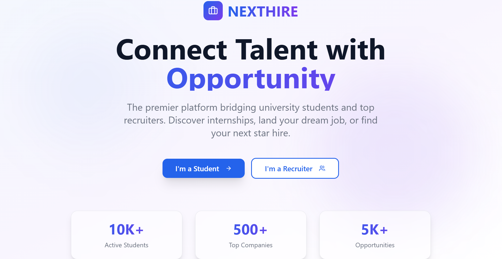
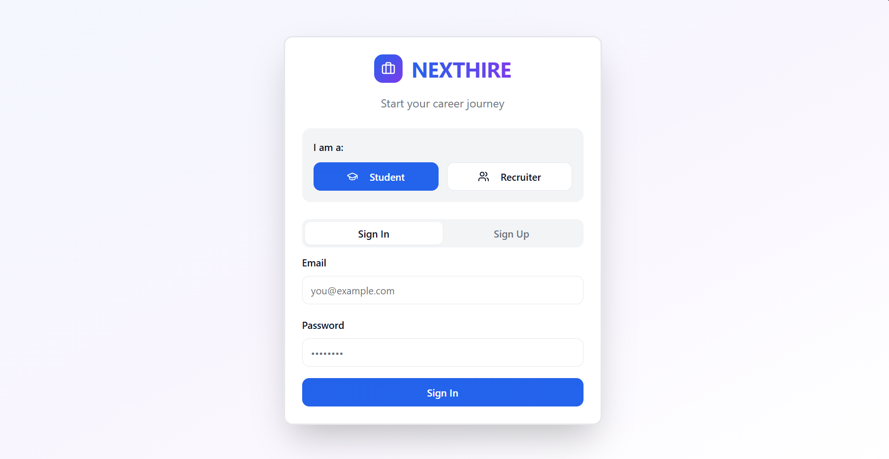

<!-- AIGNITE Banner (centered) -->

  <h1> AIGNITE 2K25</h1>
  
<strong>Powered by MLSC</strong>

---

  <strong>NextHire</strong> 
  <em>The future of campus placements</em>

---

## 📖 Project Description
✨ *Problem Statement:*
 Current campus placement system creates multiple challenges:
                            Rigid Selection Criteria – GPA cutoffs overshadow real talent..
                            Overemphasis on Aptitude – Focus on puzzles, not actual skills.
                            One Student, One Offer Rule – Students lose freedom of choice.
                            Pressure to Accept – Limited time to decide leads to mismatches.
                            Rushed Preparation – Little time to build portfolio/skills before placement season.

                            
💡 *Proposed Solution:*  
Let students build digital skill profiles (certificates, GitHub, LinkedIn).
                          Allows companies to select candidates directly from the app.
                          Uses Azure AI filters to match students with relevant roles.
                          Removes arbitrary GPA cutoffs and focuses on skills + projects.
                          Provides flexible offer timelines to reduce decision pressure.

🎯 *Target Users / Use Cases:* Students: Want fair, skill-based opportunities and freedom to explore multiple offers. 
Recruiters: Seek efficient, AI-driven access to pre-verified, skill-focused candidates. 
Colleges/Placement Cells: Need a transparent, modern, and automated platform to manage placement activities. 

---

## 🔬 Methodology
1. *Research & Ideation* – 
                           ➡Studied current campus placement systems and their inefficiencies (e.g., rigid GPA cutoffs, lack of transparency, one-offer rule). 
                           ➡Conducted interviews and surveys with students, placement officers, and recruiters to identify real-world pain points. 
                           ➡Brainstormed solutions leveraging Azure AI, .NET Core, and cloud technologies.   
2. *Design* – 
              ➡️Created wireframes for student and recruiter dashboards. 
              ➡️Designed intuitive UI/UX emphasizing simplicity and accessibility. 
              ➡️Defined system architecture integrating React+vite frontend with ASP.NET Core backend and Azure SQL Database.    
3. *Develop* – 
                 ➡Built REST APIs for authentication, profile management, and job postings. 
                 ➡️Integrated GitHub and LinkedIn APIs for auto-fetching student profiles. 
                 ➡️Implemented AI-driven candidate matching via Azure Cognitive Services.  
4. *Test* – 
            ➡️Conducted unit and integration testing for API endpoints and UI components. 
            ➡️Collected feedback from a pilot group of students and recruiters to refine the UX and AI-matching algorithm.   
5. *Deploy* – 
             ➡️Hosted application using Azure App Service. 
             ➡️Enabled continuous deployment pipelines through GitHub Actions. 
             ➡️Collected performance metrics and usage data through Azure Monitor.   
6. *Future Scope* – 
                  ➡️ Introduce AI-powered resume scoring and interview simulation. 
                    ➡️Add company analytics dashboard with predictive hiring insights. 
                    ➡️Expand to inter-college placement networks with blockchain verification for credentials.  

---

## 👥 Team Details
*Team Name:* Code Piece

| Name | Role | Email |
|---|---:|---|
| Hasini Raj| Team Lead | 2411CS020136@mallareddyuniversity.ac.in |
| Sri Laxmi| Team Member| 2411CS010044@mallareddyuniversity.ac.in |
| Tejaswini| Team Member | 2411CS010577@mallareddyuniversity.ac.in |

---

## 🛠 Technology Stack
React + vite | ASP.NET Core (C#) with REST APIs | Azure SQL Database | Microsoft Azure|

---

## 📹 Demonstration Video
▶ https://drive.google.com/file/d/1NjdJIVs1-SBiNpAOHn1BYX3oI3ME64_M/view?usp=drivesdk

---

## 🌐 Deployment
🔗 https://student-hiring-co.lovable.app
---

## 📚 References
1. Documentation & Tools
    React.js Official Docs — https://react.dev
2. Research Papers / Articles
    “Design Thinking in Software Development” — International Journal of Computer Science, 2023
   
---

## 🖼 Assets / Screenshots

   
   
   
    
   
   

---
